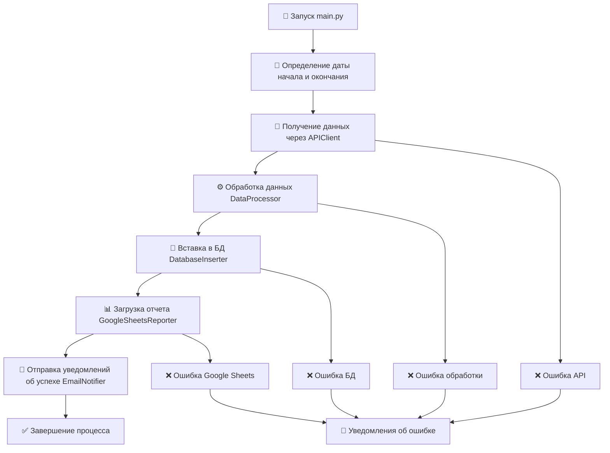

# 🎓 LMS Analytics Pipeline
ETL-процесс для автоматического сбора, обработки и анализа данных об учебных активностях студентов обучающей системы (LMS) крупного онлайн-университета.

 <br>

## 🎯 Задача

📊 **Автоматический сбор данных**

Регулярно получать данные о попытках студентов через REST API корпоративного клиента.

🔍 **Обработка и валидация**

Очистка и преобразование сырых данных с проверкой на корректность.

💾 **Хранение в PostgreSQL**

Сохранение структурированных данных для долгосрочного анализа.

📅 **Логирование**

Информирование обо всех стадиях и надежная обработка ошибок.

📈 **Автоматические отчеты**

Загрузка ежедневной статистики в Google Sheets.

📧 **Уведомления  по почте**

Email-оповещения об успешном выполнении или ошибках.

 <br>

## 🏗️ Архитектура проекта
```
lms-analytics-pipeline/
├── etl/    # ETL-пайплайн
│   ├── main.py        # Главный скрипт ETL-процесса
│   └── components/    # Модульные компоненты
│	    ├── __init__.py				     # Превращает папку "components" в Python пакет
│       ├── api_client.py                # Получение данных с помощью API клиента
│       ├── data_processor.py            # Обработка и валидация данных
│       ├── database_inserter.py         # Вставка данных в БД
│       ├── google_sheets_reporter.py    # Загрузка статистики в Google Sheets
│       ├── email_notifier.py            # Отправка email уведомлений
│       └── logger_configs.py            # Настройка логирования
├── requirements.txt    # Зависимости Python
├── README.md           # Описание проекта
└── .gitignore          # Игнорируемые файлы
```

### ETL процесс:
Код написан в стиле ООП и состоит из пяти классов.
1. **Extract** - извлечение данных через класс `APIClient`
2. **Transform** - обработка и валидация через класс `DataProcessor`
3. **Load** - сохранение в БД через класс `DatabaseInserter`
4. **Report** - загрузка отчетов через класс `GoogleSheetsReporter`
5. **Notify** - отправка уведомлений по почте через класс `EmailNotifier`

---
<br>

# 🔄 Принцип работы

<br>

## 📋 Общая схема работы пайплайна

- Скрипт запускается раз в 3 дня.
- Обрабатываются данные за последние 3 дня.
- Логи сохраняются в папке `logs/` (находится в `.gitignore`) в формате `YYYY-MM-DD.log`.
- Автоматически удаляются логи, которым 9 дней и более.
- Дубликаты в БД не попадают.
- Уведомления приходят на почту мне и всем коллегам. 

<br>

## 📝 Лог-файл
Так выглядит лог-файл в случае успешной работы скрипта:

  

 <br>
 <br>

## 📋 Описание таблицы `attempts` в PostgreSQL
| Поле | Описание |
|------|----------|
| `user_id` | Строковый идентификатор пользователя |
| `oauth_consumer_key` | Уникальный токен клиента |
| `lis_result_sourcedid` | Ссылка на блок, в котором находится задача в LMS |
| `lis_outcome_service_url` | URL адрес в LMS, куда отправляется оценка |
| `is_correct` | Была ли попытка верной (`true`/`false`), `NULL` если тип попытки `run` |
| `attempt_type` | Тип попытки: `run` (тестовый запуск) или `submit` (проверка кода) |
| `created_at` | Дата и время создания попытки |

<br>

## 📊 Google Sheets
Пример статистики, которую мы получаем за последние 3 дня:


<br>
<br>

## 📧 Email-уведомление
Письмо об успешной работе скрипта, приходящее на почту:


---
<br>

 # ⚙️ Конфигурация

 ### 1. Настройка базы данных
```sql
-- Создание базы данных (если еще не существует)
CREATE DATABASE db_name; -- Меняем db_name на нужное имя

CREATE TABLE IF NOT EXISTS attempts (
	id SERIAL PRIMARY KEY,
    user_id VARCHAR(32) NOT NULL,
    oauth_consumer_key TEXT,
    lis_result_sourcedid TEXT,
    lis_outcome_service_url TEXT,
    is_correct BOOLEAN,
    attempt_type VARCHAR(10) NOT NULL CHECK (attempt_type IN ('run', 'submit')),
    created_at TIMESTAMP NOT NULL,
    CONSTRAINT unique_attempt UNIQUE (user_id, attempt_type, created_at)
);
```


### 2. Настройка виртуального окружения
```bash
# 1. Переходим в папку проекта
cd lms-analytics-pipeline

# 2. Создаем виртуальное окружение
python -m venv venv

# 3. Активируем виртуальное окружение
venv\Scripts\activate

# 4. Устанавливаем зависимости
pip install -r requirements.txt

# 5. Деактивация окружения (когда закончили работу)
deactivate
```


### 3. Настройка переменных окружения
Редактируем файл `.env`.
```
# API Configuration
API_URL=ваш_url
API_CLIENT=ваш_клиентский_идентификатор
API_CLIENT_KEY=ваш_секретный_ключ

# Database Configuration
DB_HOST=ваш_хост
DB_NAME=имя_бд
DB_USER=пользователь_бд
DB_PASSWORD=ваш_пароль

# Google Sheets Configuration
GOOGLE_SHEETS_CREDENTIALS_BASE64=ваш_base64_ключ_сервисного_аккаунта
SPREADSHEET_ID=ид_вашей_google_таблицы

# Чтобы получить GOOGLE_SHEETS_CREDENTIALS_BASE64, нужно взять JSON-файл с токеном доступа к сервисному аккаунту и закодировать его с помощью Base64.
# Полученная строка и будет GOOGLE_SHEETS_CREDENTIALS_BASE64.


# Email Configuration
SMTP_SERVER=smtp.mail.ru
SENDER_EMAIL=ваш_email
SENDER_PASSWORD=ваш_пароль_приложения
RECIPIENTS_EMAILS=email1@example.com,email2@example.com
```

---
<br>

## 🛠️ Технологический стек
- Python 3.11 - основной язык разработки.
- PostgreSQL - реляционная база данных.
- Google Sheets API - загрузка отчетов.
- pandas - обработка и агрегация данных
- requests - get-запросы к API
- psycopg2 - Python-адаптер для PostgreSQL
- python-dotenv - управление конфигурацией
- logging - встроенная система логирования
