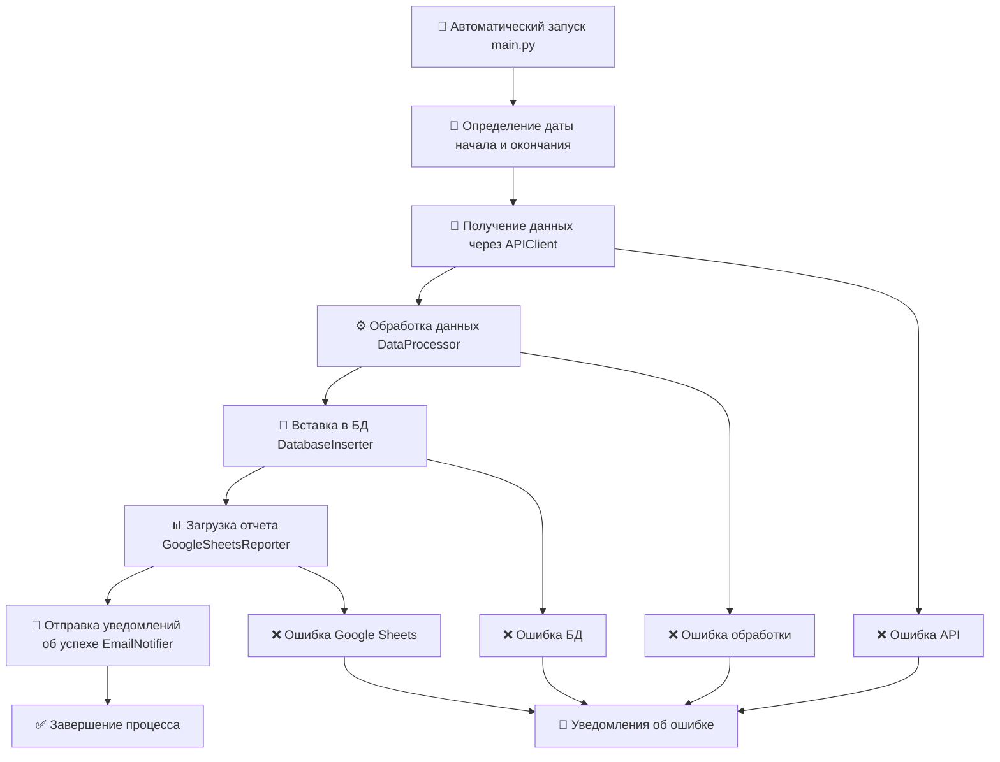

# 🎓 LMS Analytics Pipeline
ETL-процесс для автоматического сбора, обработки и анализа данных об учебных активностях студентов обучающей системы (LMS) крупного онлайн-университета. Система работает в полностью автоматическом режиме на удаленном сервере, ежедневно в 7:00 запускается через cron, обрабатывает данные тысяч студентов, сохраняет их в PostgreSQL, формирует отчеты в Google Sheets, обновляет дашборды в Metabase и отправляет уведомления по почте.
### Ссылка на дашборд:
<a href="http://89.111.174.116:3002/public/dashboard/e9da0e82-c937-4f80-a213-39cb70815b52?date=#refresh=3600" target="_blank">↗️ LMS Analytics Overview</a>
*Нажмите правой кнопкой мыши → "Открыть ссылку в новой вкладке"*

<br>

## 🎯 Цель
Оперативный мониторинг ключевых образовательных метрик и снижение временных затрат на рутинную аналитику.

## 📌 Задачи

⏰ **Автоматический сбор данных**

Ежедневно получать данные о попытках решения задач студентами через REST API корпоративного клиента.

🔍 **Обработка и валидация**

Очистка и преобразование сырых данных с проверкой на корректность.

💾 **Хранение в PostgreSQL**

Сохранение структурированных данных для долгосрочного анализа.

📅 **Логирование**

Информирование обо всех стадиях и надежная обработка ошибок.

📊 **Автоматические отчеты**

Загрузка ежедневной статистики в Google Sheets.

📧 **Уведомления  по почте**

Email-оповещения об успешном выполнении или ошибках.

🤖 **Автоматизация и деплой**

На удаленном сервере развернуть БД и BI-систему. Автоматизировать работу скрипта с помощью cron.

📈 **Дашборд**  

Визуализация метрик в реальном времени через Metabase.

 <br>

## 🏗️ Архитектура проекта
```
lms-analytics-pipeline/
├── ddl/		# SQL-запросы с DDL-командами
│   └── create_table_attempts.sql		# Создание таблицы attempts
│
├── etl/    # ETL-пайплайн
│   ├── main.py        # Главный скрипт ETL-процесса
│   └── components/    # Модульные компоненты
│	    ├── __init__.py				     # Превращает папку "components" в Python пакет
│       ├── api_client.py                # Получение данных с помощью API клиента
│       ├── data_processor.py            # Обработка и валидация данных
│       ├── database_inserter.py         # Вставка данных в БД
│       ├── google_sheets_reporter.py    # Загрузка статистики в Google Sheets
│       ├── email_notifier.py            # Отправка email уведомлений
│       └── logger_configs.py            # Настройка логирования
│
├── bi_system/		# BI-система 
│   ├── dashboard.md		# Описание дашборда Metabase
│   └── sql_queries/		# SQL-запросы для визуализаций
│       ├── dau.sql                          # Daily Active Users
│       ├── attempts_count.sql               # Кол-во попыток
│       ├── attempt_type_distribution.sql	 # Распределение типов попыток
│       ├── success_rate.sql                 # Процент успешных попыток
│       ├── dau_dynamics.sql                 # Динамика DAU
│       ├── attempts_dynamics.sql            # Динамика кол-ва попыток
│       └── dau_vs_attempts.sql              # Зависимость DAU ~ Кол-во попыток
│
├── requirements.txt    # Зависимости Python
├── README.md           # Описание проекта
└── .gitignore          # Игнорируемые файлы
```

### ETL-процесс:
Код написан в стиле ООП и состоит из пяти классов.
1. **Extract** - извлечение данных через класс `APIClient`.
2. **Transform** - обработка и валидация через класс `DataProcessor`.
3. **Load** - сохранение в БД через класс `DatabaseInserter`.
4. **Report** - загрузка отчетов через класс `GoogleSheetsReporter`.
5. **Notify** - отправка уведомлений по почте через класс `EmailNotifier`.
6. **Automate** - автоматическое выполнение через `cron`.
7. **Visualize** - интерактивный дашборд в `Metabase`.
---
<br>

# 🔄 Принцип работы

<br>

## 🗺️ Общая схема работы пайплайна

- **Расписание:** Скрипт запускается **ежедневно в 7:00 утра** через cron на удаленном сервере.
- **Обработка данных:** Обрабатываются данные за предыдущий день.
- **Логирование:** Логи сохраняются в папке `logs/` (находится в `.gitignore`) в формате `YYYY-MM-DD.log`.
- **Очистка логов:** Автоматически удаляются логи, которым 3 дня и более.
- **Уникальность данных:** Дубликаты в БД не попадают.
- **Уведомления:** Оповещения приходят на почту мне и всем коллегам.
- **Дашборд:** Результаты доступны в реальном времени через Metabase.

<br>

## 🚀 Автоматизация (cron)
Настройка cron для ежедневного запуска скрипта:


<br>
<br>

## 📝 Лог-файл
Так выглядит лог-файл в случае успешной работы скрипта:


 <br>
 <br>

## 📋 Описание таблицы `attempts` в PostgreSQL
| Поле | Описание |
|------|----------|
| `user_id` | Строковый идентификатор пользователя |
| `oauth_consumer_key` | Уникальный токен клиента |
| `lis_result_sourcedid` | Ссылка на блок, в котором находится задача в LMS |
| `lis_outcome_service_url` | URL адрес в LMS, куда отправляется оценка |
| `is_correct` | Была ли попытка верной (`true`/`false`), `NULL` если тип попытки `run` |
| `attempt_type` | Тип попытки: `run` (тестовый запуск) или `submit` (проверка кода) |
| `created_at` | Дата и время создания попытки |

<br>

## 📊 Google Sheets
Пример статистики, которую мы получаем:


<br>
<br>

## 📧 Email-уведомление
Письмо об успешной работе скрипта, приходящее на почту:


<br>
<br>

## 📈 Дашборд
<details> 
<summary>Нажмите, чтобы увидеть скрины дашборда</summary>


</details>
<br>

---
<br>

 # ⚙️ Конфигурация
Операционная система удаленного сервера: Ubuntu 24.04 LTS

 ### 1. Настройка удаленного сервера
```bash
# Подключаемся к удаленному серверу
ssh user@ip
# Далее вводим пароль  

# Обновляем список пакетов
sudo apt update

# Устанавливаем pip
sudo apt install python3-pip

# Устанавливаем Python 3.11
sudo apt install python3.11 python3.11-venv python3.11-dev

# Устанавливаем последнюю версию PostgreSQL
sudo apt-get -y install postgresql

# Cоздаем локальную копию удалённого репозитория 
cd ../home    # Переходим в нужную папку
git clone https://github.com/iwswmb/lms-analytics-pipeline
```

 ### 2. Настройка базы данных
```sql
-- Подключаемся по SSH

-- Создаем базу данных
CREATE DATABASE db_name; -- Меняем db_name на нужное имя

-- Создаем таблицу attempts
CREATE TABLE IF NOT EXISTS attempts (
	id SERIAL PRIMARY KEY,
    user_id VARCHAR(32) NOT NULL,
    oauth_consumer_key TEXT,
    lis_result_sourcedid TEXT,
    lis_outcome_service_url TEXT,
    is_correct BOOLEAN,
    attempt_type VARCHAR(10) NOT NULL CHECK (attempt_type IN ('run', 'submit')),
    created_at TIMESTAMP NOT NULL,
    CONSTRAINT unique_attempt UNIQUE (user_id, attempt_type, created_at)
);
```


### 3. Настройка виртуального окружения
```bash
# 1. Переходим в папку проекта
cd lms-analytics-pipeline

# 2. # Создаем виртуальное окружение с Python 3.11
python3.11 -m venv venv

# 3. Активируем виртуальное окружение (Linux)
source venv/bin/activate

# 4. Устанавливаем зависимости
pip install -r requirements.txt

# 5. Деактивация окружения (когда закончили работу)
deactivate
```


### 4. Настройка переменных окружения
Редактируем файл `.env`.
```env
# API Configuration
API_URL=ваш_url
API_CLIENT=ваш_клиентский_идентификатор
API_CLIENT_KEY=ваш_секретный_ключ

# Database Configuration
DB_HOST=ваш_хост
DB_PORT=5432
DB_NAME=имя_бд
DB_USER=пользователь_бд
DB_PASSWORD=ваш_пароль

# Google Sheets Configuration
GOOGLE_SHEETS_CREDENTIALS_BASE64=ваш_base64_ключ_сервисного_аккаунта
SPREADSHEET_ID=id_вашей_google_таблицы

# Чтобы получить GOOGLE_SHEETS_CREDENTIALS_BASE64, нужно взять JSON-файл с токеном доступа к сервисному аккаунту и закодировать его с помощью Base64.
# Полученная строка и будет GOOGLE_SHEETS_CREDENTIALS_BASE64.


# Email Configuration
SMTP_SERVER=smtp.mail.ru
SMTP_PORT=587
SENDER_EMAIL=ваш_email
SENDER_PASSWORD=ваш_пароль_приложения
RECIPIENTS_EMAILS=email1@example.com,email2@example.com
```

### 5. Настройка Metabase
```bash
# Устанавливаем Docker
sudo apt update
sudo apt install curl software-properties-common ca-certificates apt-transport-https -y
wget -O- https://download.docker.com/linux/ubuntu/gpg | gpg --dearmor | sudo tee /etc/apt/keyrings/docker.gpg > /dev/null
echo "deb [arch=amd64 signed-by=/etc/apt/keyrings/docker.gpg] https://download.docker.com/linux/ubuntu jammy stable"| sudo tee /etc/apt/sources.list.d/docker.list > /dev/null
sudo apt update
sudo apt install docker-ce -y

# Устанавливаем Docker Compose Plugin
sudo apt install docker-compose-plugin -y

# Устанавливаем nginx
sudo apt install nginx

Создаем конфигурационный файл для Docker Compose
nano docker-compose.yml
```
<details>
	
<summary>Посмотреть структуру docker-compose.yml</summary>
	
```yaml
services:
  metabase:
    image: metabase/metabase:latest
    container_name: metabase
    restart: unless-stopped
    ports:
      - "3002:3000"
    environment:
      JAVA_TOOL_OPTIONS: "-Xmx768m -Xms512m -XX:+UseSerialGC"
      MB_DB_TYPE: postgres
      MB_DB_DBNAME: ваша_бд
      MB_DB_PORT: 5432
      MB_DB_USER: ваш_пользователь
      MB_DB_PASS: ваш_пароль
      MB_DB_HOST: ваш_хост
      MB_EMBEDDING_CACHE_TTL: "60"
      MB_QUERY_CACHING_MAX_KB: "1000"
      MB_LOG_LEVEL: "INFO"
    volumes:
      - metabase-data:/metabase-data
    deploy:
      resources:
        limits:
          memory: 1400M
        reservations:
          memory: 1024M
    healthcheck:
      test: ["CMD", "curl", "-f", "http://localhost:3000/api/health"]
      interval: 30s
      timeout: 10s
      retries: 3
      start_period: 180s

volumes:
  metabase-data:
```

</details>

```bash
# Запускаем Metabase
docker compose up -d

# Проверяем статус
docker compose ps

# Выключаем Metabase (когда закончили)
docker compose down
```

### 6. Настройка cron
```bash
# Открываем файл crontab
EDITOR=nano crontab -e

# Добавляем строку
0 7 * * * /home/lms-analytics-pipeline/venv/bin/python /home/lms-analytics-pipeline/etl/main.py
```
---
<br>

## ✅ Результаты внедрения
- **Полная автоматизация:** Большая экономия времени, поскольку нет ручного сбора данных.
- **Интерактивные дашборды:** Метрики доступны в реальном времени, можно быстро выявлять потенциальные проблемы.
- **Централизованная аналитика:** Все данные в одном месте.
- **Проактивные уведомления:** Ошибки обнаруживаются мгновенно.
- **Масштабируемость:** Система готова к росту нагрузки.
<br>

## 🛠️ Технологический стек
- **Python 3.11** - основной язык разработки.
- **PostgreSQL** - реляционная база данных.
- **Metabase** - BI-система для визуализации.
- **Google Sheets API** - загрузка отчетов.
- **pandas** - обработка и агрегация данных.
- **requests** - get-запросы к API.
- **psycopg2** - Python-адаптер для PostgreSQL.
- **python-dotenv** - управление конфигурацией.
- **logging** - встроенная система логирования.
- **cron** - планировщик задач на Linux.
- **Docker** - контейнеризация Metabase.
- **Linux/Ubuntu** - операционная система сервера.
